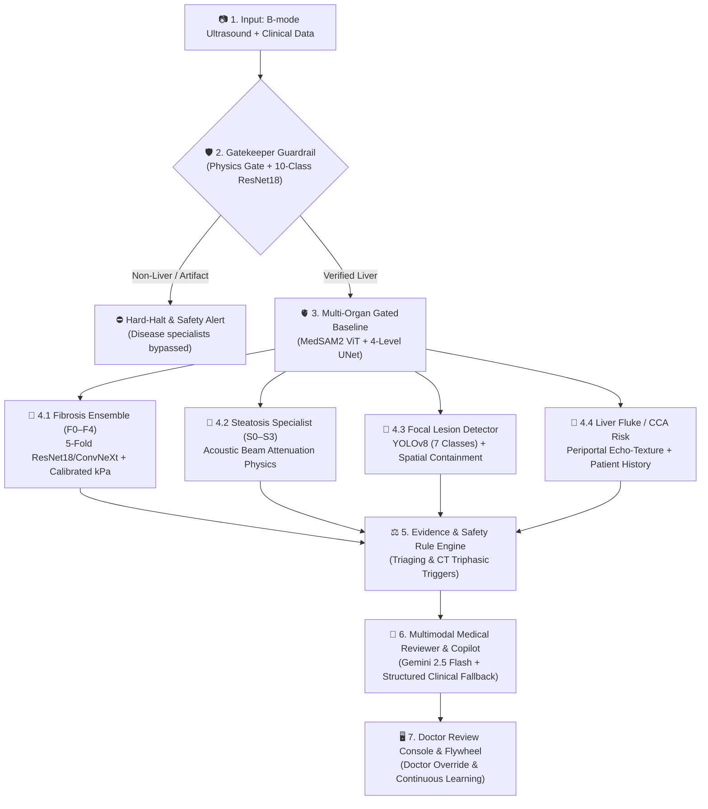

# SmartLiva: Liver Ultrasound Clinical AI & Screening Copilot 🏥✨

[](https://fastapi.tiangolo.com)
[](https://react.dev)
[](https://pytorch.org)
[](https://github.com/bowang-lab/MedSAM)
[](LICENSE)
[](#-stage-2-pilot-shadow-study--flywheel)

**SmartLiva** is a high-precision, clinical-grade AI Decision Support System (CDSS) and Screening Copilot for B-mode Liver Ultrasound. Built on a **100% Gated Multi-Organ Baseline Architecture**, SmartLiva ensures that all disease models only execute on verified liver tissue, eliminating hallucinations and misclassifications on non-liver images.

---

## 📑 Table of Contents
- [Clinical Architecture](#-clinical-architecture)
- [Core AI Engines & Specialists](#-core-ai-engines--specialists)
- [Repository Structure](#-repository-structure)
- [Quickstart Guide](#-quickstart-guide)
- [API Reference](#-api-reference)
- [Stage 2: Pilot Shadow Study & Flywheel](#-stage-2-pilot-shadow-study--flywheel)
- [Testing & Quality Verification](#-testing--quality-verification)
- [GitHub Repository Setup](#-github-repository-setup)

---

## 🏛️ Clinical Architecture



---

## 🧠 Core AI Engines & Specialists

### 1. 🛡️ Non-Liver Ultrasound Hard-Gating Harness (Guardrail)
* **B-Mode Physics Envelope**: Analyzes speckle distribution, content fraction, dynamic range, and entropy to reject non-medical images or corrupted signals.
* **10-Class ResNet-18 Organ Gate**: Classifies image across 10 anatomical organs (*Liver, Kidney, Spleen, Heart, Thyroid, Breast, Bladder, Carotid, etc.*).
* **Hard-Halt Guarantee**: If an image is not liver or liver coverage is $< 5.0\%$, the pipeline halts immediately with `is_liver_us: False`, completely bypassing disease models.

### 2. 🫀 Multi-Organ Gated Baseline
* **MedSAM2 + 4-Level UNet Dual Segmenter**: Extracts pixel-accurate Liver and Gallbladder masks.
* **Gallbladder Mutual Exclusion**: Automatically subtracts gallbladder pixels from the liver parenchyma to ensure pure hepatic feature extraction.

### 3. 🧬 4-in-1 Disease Specialist Engines
| Specialist | Architecture | Output / Staging | Clinical Metric |
| :--- | :--- | :--- | :--- |
| **Fibrosis Staging** | 5-Fold ResNet-18 / ConvNeXt Ensemble | **F0, F1, F2, F3, F4** | Calibrated kPa estimate, Risk Tier (Low / Moderate / High) |
| **Steatosis (Fatty Liver)** | Acoustic Physics & Parenchymal Brightness | **S0, S1, S2, S3** | Beam Attenuation Ratio ($I_{\text{near}}/I_{\text{far}}$), Echogenicity index |
| **Focal Lesion Detection** | YOLOv8 (7 Classes) | Bounding Boxes & Classes | HCC, CCA, Hemangioma, Cyst, Focal Fatty Sparing, Focal Fatty Change |
| **Fluke / CCA Risk** | Texture Analysis + Clinical History | Negative / Suspicious | Periportal cuffing index & raw fish consumption factor |

### 4. 🗄️ SQLite Data Flywheel (Doctor-in-the-Loop)
* Allows clinicians to confirm or override AI predictions in real-time.
* Logs physician decisions, modified bounding boxes, and clinical notes to `flywheel.db` for automated active learning.

---

## 🗂️ Repository Structure

```text
SmartMed-Smartliva/
├── app.py                      # Production entrypoint (python app.py)
├── run.py                      # One-click interactive launcher (python run.py)
├── requirements.txt            # Python dependencies
├── requirements-gpu.txt        # Optional GPU acceleration dependencies
├── Dockerfile                  # Containerized deployment file
├── docker-compose.yml          # Container orchestration
├── .gitignore                  # Git rules (PDPA compliant)
├── README.md                   # System Documentation
│
├── frontend/                   # 🖥️ Modern Web UI (Vite + React 19 + TypeScript + Tailwind)
│   ├── src/                    # Review Console, Layer Controls, Flywheel Modal, Canvas
│   ├── dist/                   # Production build bundle (served by FastAPI)
│   ├── package.json            # Node dependencies
│   └── vite.config.ts          # Vite build config
│
├── src/                        # 🧠 Core Backend & AI Engines (Python Package)
│   ├── api/                    # FastAPI Server endpoints
│   ├── models/                 # Model architectures (Gate, MedSAM2, UNet, Fibrosis, Lesion)
│   ├── workflow/               # Orchestrator, Gatekeeper, Specialists, Verifiers, Schemas
│   ├── database/               # SQLite Flywheel Database manager (flywheel.py)
│   └── config.py               # Central environment and path configuration
│
├── weights/                    # ⚖️ Deep Learning Model Checkpoints (see weights/README.md)
│   ├── organ_gate/             # ResNet-18 10-Class Gatekeeper
│   ├── liver_prompt/           # YOLO Liver Bounding Box Prompter
│   ├── medsam2/                # MedSAM2 ViT Checkpoints
│   ├── multiorgan/             # UNet Multi-Organ Segmenter
│   ├── fibrosis/               # 5-fold ResNet-18/ConvNeXt Fibrosis Ensemble
│   └── lesion/                 # YOLOv8 Focal Lesion Detector
│
├── data/                       # 📁 Clinical Data & Flywheel DB
│   ├── flywheel/               # SQLite Flywheel database (flywheel.db)
│   └── README.md               # Data storage & PDPA clinical guidelines
│
├── public/                     # 🖼️ Sample clinical ultrasound cases & assets
│   ├── samples/                # Real patient ultrasound cases
│   └── *.png                   # Brand logos and icons
│
└── tools/                      # 🧪 Testing, Benchmarking & Audit Tools
    ├── eval_cases.py           # Real patient batch evaluation suite
    ├── shadow_study_manager.py # Pilot Shadow Study & Flywheel Concordance Analyzer
    ├── test_gatekeeper_harness.py # Non-Liver Hard-Gating Guardrail test suite
    └── test_integration.py     # 14/14 Unified End-to-End Integration Tests
```

---

## 🚀 Quickstart Guide

### Prerequisites
* **Python 3.10+** (Recommended: Python 3.11/3.12)
* **Node.js 18+** & `npm` (Only needed if rebuilding the frontend)
* **CUDA / Apple Silicon MPS / CPU** supported automatically.

### 1. Clone & Setup Environment
```bash
git clone https://github.com/KingPhuripol/SmartMed-Smartliva.git
cd SmartMed-Smartliva

# Create Python Virtual Environment
python3 -m venv .venv
source .venv/bin/activate   # On Windows: .venv\Scripts\activate

# Install Python Dependencies
pip install -r requirements.txt
```

### 2. Build Frontend (Optional - Pre-built in `frontend/dist/`)
```bash
cd frontend
npm install
npm run build
cd ..
```

### 3. Launch Application
```bash
# Using One-Click Runner
python run.py

# Or using production app.py
python app.py --port 8000
```
* 🌐 **Web UI**: Open [http://localhost:8000](http://localhost:8000) in your browser.
* 📖 **Interactive Swagger API Docs**: [http://localhost:8000/docs](http://localhost:8000/docs)

---

## 📡 API Reference

| Method | Endpoint | Description |
| :--- | :--- | :--- |
| **GET** | `/health` | Server health check & active model status |
| **POST** | `/api/v1/liver/analyze` | Comprehensive multi-organ orchestrated clinical workflow |
| **POST** | `/analyze` | Supervisor v1.1 endpoint (Organ Gate + UNet Contour) |
| **POST** | `/api/v1/agents/fibrosis` | Fibrosis Staging Agent (F0–F4) + kPa estimation |
| **POST** | `/api/v1/agents/lesion` | YOLOv8 Focal Lesion Detection Agent |
| **POST** | `/api/v1/agents/steatosis` | Hepatic Steatosis Attenuation Agent (S0–S3) |
| **POST** | `/api/v1/agents/fluke` | Liver Fluke & CCA Risk Assessment Agent |
| **POST** | `/api/feedback` | Submit doctor review & audit to SQLite Flywheel |
| **GET** | `/api/feedback/history` | Retrieve recent audited clinical reviews |
| **POST** | `/api/v1/copilot/chat` | AI Medical Copilot chat (Gemini 2.5 Flash) |
| **GET** | `/api/samples` | List sample clinical ultrasound cases |

---

## 🔬 Stage 2: Pilot Shadow Study & Flywheel

During clinical shadow trials, clinicians review cases in the Web UI, adjust or confirm findings, and submit them to the SQLite Flywheel.

### View Real-Time Doctor-AI Concordance Rates:
```bash
python tools/shadow_study_manager.py --summary
```

### Export Audited Datasets for Retraining:
```bash
python tools/shadow_study_manager.py --export clinical_dataset_round1.json
```

---

## 🧪 Testing & Quality Verification

SmartLiva includes comprehensive test suites covering unit physics, guardrails, and full end-to-end integration.

```bash
# 1. Run all 14 Unified Integration Tests
python tools/test_integration.py

# 2. Run Non-Liver Gatekeeper Hard-Gating Harness Tests
python tools/test_gatekeeper_harness.py

# 3. Run Real Patient Clinical Batch Benchmark
python tools/eval_cases.py
```

---

## 🔗 GitHub Repository Setup

To push this repository to your GitHub remote:

```bash
# Add or update remote URL
git remote set-url origin https://github.com/KingPhuripol/SmartMed-Smartliva.git

# Stage all files
git add .

# Create initial commit
git commit -m "feat: complete SmartLiva v1.1 clinical architecture with gated baseline, multi-organ segmentation, and flywheel"

# Push to main branch
git branch -M main
git push -u origin main
```

---

## 👥 Contributors & Acknowledgements
* **SmartMed Team**
* Core Development: King Phuripol
* Research & Clinical AI Engineering
