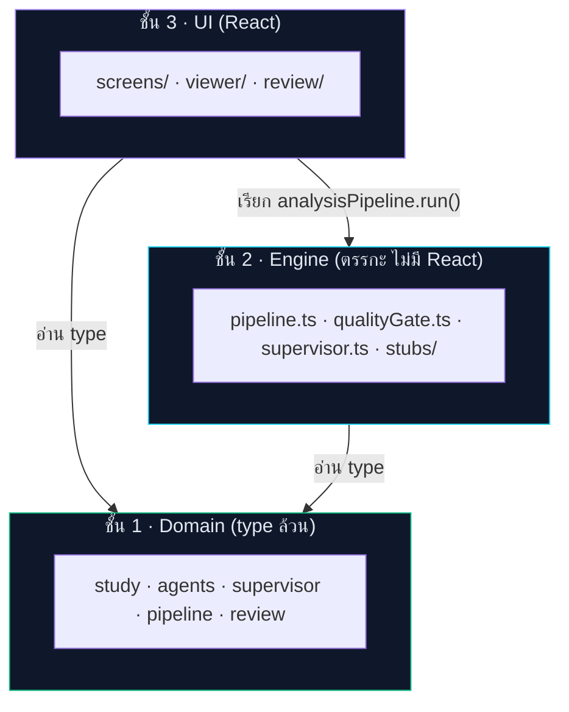
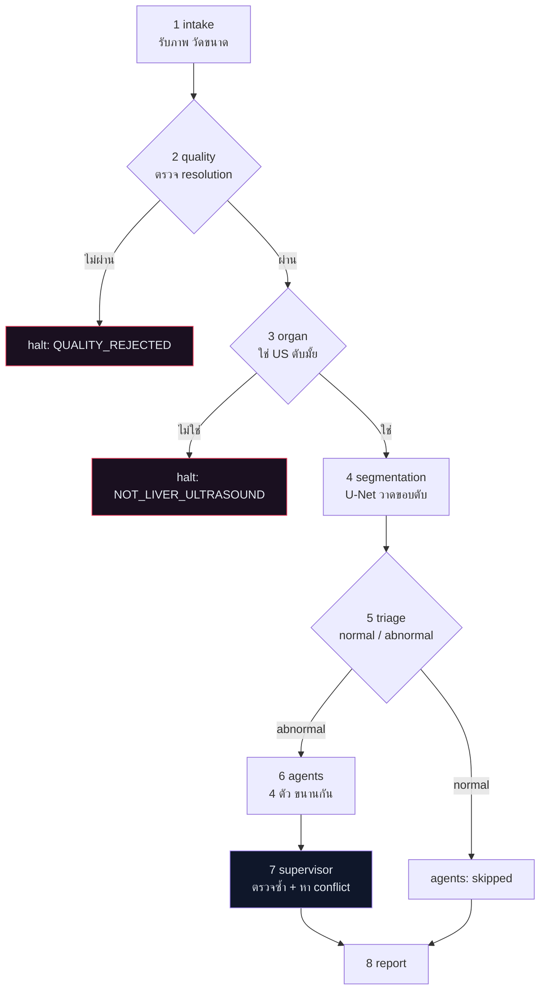
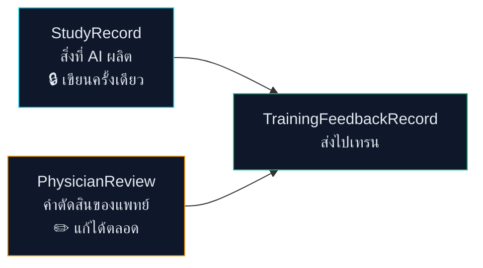
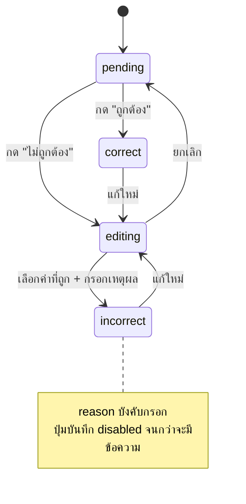

# SmartLiva — Map การทำงานของโปรแกรม (v2)

เอกสารนี้อธิบายว่า "อะไรเกิดขึ้นที่ไหน" ในโค้ด ตามสถาปัตยกรรม v2 ที่เป็น
**gated pipeline + agent 4 ตัว + LLM supervisor + แพทย์ตรวจรายตัว**

Spec ต้นทาง: `~/Desktop/SmartLIVA/2026-08-11-flow-spec-v2.md`

---

## 1. โครงสร้าง 3 ชั้น

กฎเดียวที่ทำให้ระบบนี้ไม่ต้องเขียนใหม่: **ชั้นล่างไม่รู้จักชั้นบน**



| ชั้น | โฟลเดอร์ | มีอะไร | เปลี่ยนบ่อยแค่ไหน |
|---|---|---|---|
| Domain | `src/domain/` | type + ค่าคงที่ + helper บริสุทธิ์ | **แทบไม่เปลี่ยน** — นี่คือสัญญา |
| Engine | `src/engine/` | pipeline, quality gate, supervisor, stub ของโมเดล | เปลี่ยนตอนเสียบโมเดลจริง |
| UI | `src/components/` | หน้าจอทั้งหมด | เปลี่ยนบ่อยสุด |
| Config | `src/config/` | เกณฑ์คุณภาพ · สีของ agent · ข้อความ · ชื่อ stage | ปรับได้โดยไม่แตะตรรกะ |

---

## 2. Pipeline 8 ด่าน



ทุกด่านจบด้วยสถานะเดียวใน 6 แบบ: `pending · running · passed · rejected · skipped · failed`
`StudyRecord.halt` บอกเสมอว่าหยุดที่ด่านไหนเพราะอะไร — **ไม่มี null ลอย ๆ ให้เดา**

โค้ด: [pipeline.ts](src/engine/pipeline.ts)

---

## 3. สถานะของโมเดลจริง ณ ตอนนี้

| ด่าน | สถานะโค้ด | สถานะโมเดล |
|---|---|---|
| quality gate | ✅ **ของจริง** | ไม่ต้องใช้โมเดล เป็นการวัดล้วน |
| organ check | 🔌 stub | มีโมเดลแล้ว รอต่อ API |
| segmentation | 🔌 stub | มีโมเดลแล้ว รอต่อ API |
| triage | 🔌 stub | **ยังไม่มีโมเดล** — ตอบ `abnormal` เสมอ (ค่าที่ปลอดภัยกว่า) |
| agents ×4 | 🔌 stub | ยังไม่มี |
| supervisor | ✅ **ของจริง (rule-based)** | ยังไม่ใช่ LLM แต่ตรรกะ cross-agent ใช้ได้จริง |

ทุก output ที่มาจาก stub ติดธง `simulated: true` ซึ่งเดินทางไปถึง UI และขึ้นป้าย
**"ค่าจำลอง"** บนการ์ด — ไม่มีตัวเลข stub ตัวไหนถูกแสดงเหมือนเป็นผลจากโมเดลจริง

---

## 4. จุดเสียบโมเดลจริง — ไฟล์เดียว

[src/engine/index.ts](src/engine/index.ts) คือที่เดียวที่ประกอบ dependency ทั้งหมด

```ts
export const analysisPipeline = createPipeline({
  organCheck: stubOrganCheck,      // → httpOrganCheck('/api/v1/organ')
  segmentation: stubSegmentation,  // → httpSegmentation('/api/v1/segment')
  triage: stubTriage,              // → httpTriage('/api/v1/triage')
  agents: AGENT_RUNNERS,           // → [httpAgent('fibrosis'), ...]
  supervisor: ruleBasedSupervisor, // → llmSupervisor({ ... })
})
```

เปลี่ยนบรรทัดเดียว = ใช้โมเดลจริง **ไม่มีไฟล์ UI ไหนต้องแก้เลย**
เพิ่ม agent ตัวที่ 5 ก็แค่เติมเข้า `AGENT_RUNNERS` — การ์ด สี layer toggle รายงาน payload ตามมาเอง

---

## 5. Data model — 3 ก้อนที่แยกกันเด็ดขาด



**ทำไมต้องแยก:** ต้องตอบได้เสมอว่า "AI ตอบอะไร แพทย์แก้เป็นอะไร"
ถ้าเขียนทับกัน จะเสียทั้ง audit trail ทางการแพทย์ และ training signal ในคราวเดียว

`PhysicianReview.events` เป็น **append-only** — แก้ผิดคือเพิ่ม event ใหม่ ไม่ลบของเก่า

---

## 6. โครงสร้าง Region — ทำไม overlay ไม่เพี้ยน

ทุกอย่างที่วาดบนภาพเป็น `Region` โครงเดียวกัน ไม่ว่าใครวาด

```ts
{ regionId, shape: 'point'|'box'|'polygon'|'freehand',
  points: [[x,y], ...],        // normalized 0..1 เสมอ
  label, confidence,           // confidence = null ถ้าแพทย์วาดเอง
  source: AgentId | 'segmentation' | 'physician' }
```

`source` เป็นตัวกำหนดสี และเป็นตัวที่ layer toggle ใช้เปิด/ปิด
→ เพิ่ม agent ใหม่ = ได้สีและ toggle อัตโนมัติ

การแปลง normalized → pixel เกิดที่เดียวคือ [ImageCanvas.tsx](src/components/viewer/ImageCanvas.tsx)

---

## 7. การตรวจสอบของแพทย์



`isVerdictSettled()` ใน [review.ts](src/domain/review.ts) ถือว่า `incorrect` ที่ไม่มีเหตุผล = **ยังไม่เสร็จ**
ปุ่มออกรายงานจึงยังกดไม่ได้ — บังคับด้วยตรรกะ ไม่ใช่แค่ซ่อน UI

---

## 8. Supervisor ทำอะไรบ้าง

[supervisor.ts](src/engine/supervisor.ts) — rule-based ของจริง ไม่ใช่ stub

1. **ประเมินราย agent** → `agree` / `uncertain` / `disagree`
   (agent ที่ยัง simulated → `uncertain` เสมอ พร้อมเหตุผลว่ายังไม่มีโมเดล)
2. **หา conflict ข้าม agent** — สิ่งที่ agent เดี่ยว ๆ มองไม่เห็น
   - F4 + S0 + ไม่มีรอยโรค → พบไม่บ่อย ควรทบทวน
   - F0 + S3 → การลดทอนคลื่นเสียงอาจบดบังพังผืด
   - S2/S3 + รอยโรค confidence ต่ำ → ความน่าเชื่อถือชั้นลึกลดลง
   - fluke Positive + F0 → agent สองตัวอาจมองคนละที่
   - พบ Abscess / Suspicious mass → critical
3. **คำนวณความเสี่ยงรวม** `low → moderate → high → critical`
4. **สรุป impression + ข้อเสนอแนะ**

ผลของ supervisor **ไม่เคยทับค่าของ agent** — แสดงคู่กันให้แพทย์เห็นทั้งสองอย่าง

---

## 9. Index: จะแก้เรื่องนี้ ต้องไปไฟล์ไหน

| อยากแก้ | ไฟล์ |
|---|---|
| เสียบโมเดลจริง | [engine/index.ts](src/engine/index.ts) |
| **เกณฑ์ resolution ขั้นต่ำ** | [config/quality.ts](src/config/quality.ts) ⚠️ ยังเป็น placeholder รอตัวเลขจากอุดร |
| ข้อความปฏิเสธ / คำเตือน (ไทย+อังกฤษ) | [config/messages.ts](src/config/messages.ts) |
| สีและชื่อของ agent | [config/agentDisplay.ts](src/config/agentDisplay.ts) |
| ชนิดรอยโรค / อันไหนเร่งด่วน | [config/lesionClasses.ts](src/config/lesionClasses.ts) |
| ชื่อ/คำอธิบายด่านใน pipeline | [config/stages.ts](src/config/stages.ts) |
| กฎ conflict ของ supervisor | [engine/supervisor.ts](src/engine/supervisor.ts) → `findConflicts()` |
| เพิ่ม agent ตัวใหม่ | `domain/agents.ts` (AgentId + AgentValueMap) → `engine/stubs/agents/` → `config/agentDisplay.ts` |
| เนื้อหารายงาน | [StudyReportModal.tsx](src/components/StudyReportModal.tsx) |
| payload ที่ส่งไปเทรน | [domain/review.ts](src/domain/review.ts) → `buildTrainingFeedback()` |
| ภาพตัวอย่างสังเคราะห์ | [lib/demoScan.ts](src/lib/demoScan.ts) |

---

## 10. สิ่งที่ยังไม่มี

- **auth / ตัวตนผู้ตรวจ** — `ReviewEvent.actor` ยัง hardcode เป็น `'physician'`
- **persistence** — refresh แล้วหาย ยังไม่มี backend เก็บ StudyRecord
- **การส่งข้อมูลจริง** — ปุ่มส่งไปเทรนยังไม่ยิง network (รอเคลียร์ PDPA)
- **DICOM** — รับเฉพาะ PNG/JPEG/WebP/BMP จึงไม่มี pixel spacing จริง → `sizeMm` เป็นค่าประมาณ
- **ข้อมูลคนไข้** — รายงานเว้นช่องให้เซ็นมือ
- **overlay กับภาพที่อัปโหลดเอง** — geometry ของ stub ผูกกับภาพตัวอย่าง จะไม่ตรงกับภาพอื่น (หายไปเองเมื่อเสียบโมเดลจริง)
